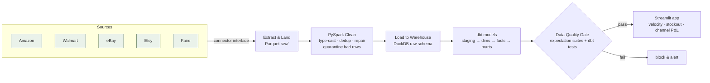

# Equine Commerce Lakehouse

A production-style **ELT / lakehouse** for a real multi-marketplace e-commerce
business ([Majestic Ally](https://majesticallyproducts.com) — equestrian &
dog gear, ~143 SKUs sold on Amazon, Walmart, eBay, Etsy, and Faire).

It ingests orders and inventory from every sales channel, lands them in a
Parquet lake, cleans and conforms them with **PySpark**, models them into a
**dbt** dimensional warehouse, gates the whole thing behind **data-quality
suites**, and serves the result as an analytics app answering the two questions
the business actually asks: *what's selling and how fast*, and *what am I about
to run out of*.

Everything runs locally and free (DuckDB stands in for the cloud warehouse; a
local folder stands in for object storage) but is written to swap to
**S3 + Snowflake/BigQuery** with config changes only — no model edits.

```
Extract ──► Land (Parquet) ──► Clean (PySpark) ──► Load ──► Model (dbt) ──► Validate ──► Serve
 5 channels    raw/ layer       clean/ layer      DuckDB   dim + fct + marts   DQ gate    Streamlit
```

## Architecture



Orchestrated end-to-end by an **Airflow** DAG (`airflow/dags/commerce_lakehouse_dag.py`)
and reproducible with one command locally.

## Quickstart

```bash
pip install -r requirements.txt      # needs Python 3.10+ and a JRE (Java 17/21) for Spark
make pipeline                        # extract → spark clean → load → dbt build → DQ gate
make dashboard                       # open the Streamlit app at localhost:8501
```

Or with Docker: `docker compose up app` (dashboard) / `docker compose up airflow` (scheduler UI).

## What the pipeline produces (example run, synthetic data)

| Metric | Value |
|---|---|
| SKUs modeled | 143 across 13 categories |
| Order lines processed | ~213K over 13 months |
| dbt models / tests | 11 models, 24 native tests |
| Data-quality expectations | 17 (catalog + sales + inventory), gating |
| Dirty rows caught & quarantined | negative/zero quantities, duplicate lines, `$`-prefixed prices, whitespace SKUs, null geographies |

The dashboard surfaces channel economics (e.g. retail channels net ~40–50%
margin vs. Faire wholesale ~13%), SKU velocity (7d/28d), and a stockout-risk
classification (`reorder_now` / `watch` / `healthy`) computed from days-of-cover
vs. replenishment lead time.

## Data model (star schema)

```
dim_product ─┐
dim_channel ─┼─◄ fct_orders (grain: order line)  ──► mart_sku_velocity
dim_date    ─┘                                    └─► mart_channel_performance
                fct_inventory_snapshot (grain: day × SKU)
```

- **`fct_orders`** — additive revenue, marketplace fee, COGS, and net margin per line.
- **`mart_sku_velocity`** — 7d/28d velocity, days-of-cover, stockout risk. *The assortment/reorder decision table.*
- **`mart_channel_performance`** — revenue, fees, and net margin by marketplace.

## Data quality

Two complementary layers, both gating:

1. **dbt native tests** — `unique`, `not_null`, `relationships` (referential
   integrity), and `accepted_values` on keys and dimensions.
2. **Expectation suites** (`src/ecl/quality/`) — a small Great-Expectations-style
   engine running catalog / sales / inventory suites against the warehouse and
   emitting a JSON + HTML report (`data/quality/dq_report.html`). Error-severity
   failures return a non-zero exit code, so the pipeline and CI both stop on bad data.

## Tech stack

**Python · SQL · PySpark · dbt · DuckDB (Snowflake/BigQuery-ready) · Airflow ·
Parquet/S3 · Great-Expectations-style DQ · Streamlit · Plotly · Docker ·
GitHub Actions**

## Going live (swap synthetic → real data)

- **CSV exports:** drop Amazon/eBay/Etsy/Walmart/Faire report CSVs in a folder
  and run `python pipelines/run_pipeline.py --source csv --csv-dir <dir>`.
- **Marketplace APIs:** implement `fetch_all` in `src/ecl/connectors/api_stubs.py`
  (credentials read from env), map the payload to the canonical schema, and
  register the connector. Downstream code is untouched.
- **Cloud warehouse:** set `WAREHOUSE_TARGET` and point dbt's `profiles.yml` at
  Snowflake/BigQuery. `LAKE_URI=s3://…` moves the lake to object storage.

## Project structure

```
config/          env-driven settings (local ↔ cloud)
src/ecl/
  catalog.py     canonical 143-SKU product master
  generate.py    synthetic multi-channel data (with realistic defects)
  connectors/    source abstraction: synthetic · csv · live API stubs
  ingest.py      extract & land raw Parquet
  spark_clean.py PySpark conforming/cleaning job
  load_duckdb.py load clean layer to warehouse
  quality/       expectation engine + catalog/sales/inventory suites
dbt/             staging → dims → facts → marts, with tests
airflow/dags/    daily orchestration DAG
app/dashboard.py Streamlit analytics app
pipelines/       one-command end-to-end runner
tests/           pytest (catalog, generation, DQ, warehouse integration)
```

## Notes

Built as a portfolio project that does real work for a real business. Synthetic
data is used by default so the repo is fully runnable without credentials; the
generator is modeled on the actual catalog shape, channels, and wholesale
economics, and every source is swappable for live data as described above.
